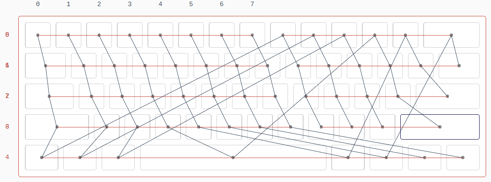

# DOCS

## 阵列

本项目目标是实现一个标准 60 阵列的蓝牙 HID 键盘，[keyboard-layout-editor](http://www.keyboard-layout-editor.com/)生成的 json 如下

```
["~\n`","!\n1","@\n2","#\n3","$\n4","%\n5","^\n6","&\n7","*\n8","(\n9",")\n0","_\n-","+\n=",{w:2},"Backspace"],
[{w:1.5},"Tab","Q","W","E","R","T","Y","U","I","O","P","{\n[","}\n]",{w:1.5},"|\n\\"],
[{w:1.75},"Caps Lock","A","S","D","F","G","H","J","K","L",":\n;","\"\n'",{w:2.25},"Enter"],
[{w:2.25},"Shift","Z","X","C","V","B","N","M","<\n,",">\n.","?\n/",{w:2.75},"Shift"],
[{w:1.25},"Ctrl",{w:1.25},"Win",{w:1.25},"Alt",{a:7,w:6.25},"",{a:4,w:1.25},"Alt",{w:1.25},"Win",{w:1.25},"Menu",{w:1.25},"Ctrl"]
```

共计 61 键，使用 9 行 8 列的矩阵扫描以节省端口，即 UNO 的 0-8 端口作为行，9-13 与 A0-2 作为列。按键关联如下图


