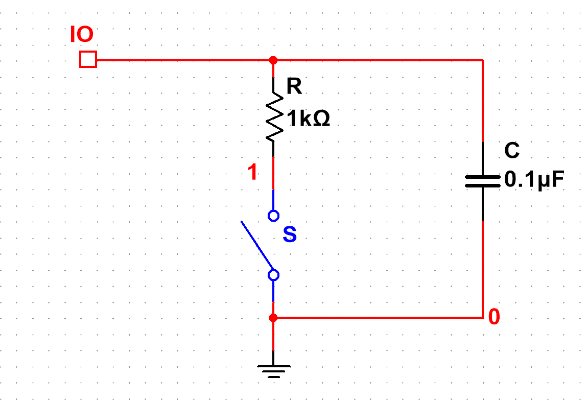

### 矩阵扫描电路设计

矩阵扫描是自制键盘常用的实现原理，此处我们实现的是一种低电平有效的矩阵扫描。

低电平有效的开关矩阵电路示意图

典型的矩阵扫描单元电路

普通的矩阵扫描电路中，每个单元一般包含开关、上拉电阻、二极管和电容 4 个器件。其中，二极管是防止多个开关同时闭合形成通路，以做到键与键之间无冲突；电容起到防抖作用。单元按行和列排列，构建成完整的矩阵扫描电路。Arduino Uno 将对这个电路逐列接地，然后逐行扫描，检测每一行的电平。如果按键按下，开关闭合，对应行的电平将会拉低，这样就能确定是哪一行哪一列的开关闭合。Arduino Uno 检测到低电平后，将对应的数据传递到片上运行的程序中，实现键盘的功能。

在设计电路之前的单元测试中，电容的上端无法接在上拉电阻的上端，因为 Arduino Uno 的接口内部自带上拉电阻。如果强行将电容接在开关两端，在开关断开瞬间电容就会通过上拉电阻充电，不仅不能防抖，反而还会产生延时。经过几次仿真和实际测试，验证了上述设计的不可行性。最终确定的电路结构中不包含电容，仅利用开关自带的防抖特性。

### PCB 设计

使用 KiCad 工具套件进行 PCB 设计。在 KiCad 自带的原理图工具 EESchema 中构建原理图之后，为每个元件分配封装、生成物料清单和网表，再使用 PCBnew 工具设计键盘 PCB 。此前已经生成的键盘定位板图纸，在这个过程中为器件的定位起到了辅助作用。

整个电路原理图

将所有器件的封装调整到指定位置之后，对 PCB 进行布线。本着一定的研究学习目的，我们同时试验了手动和自动布线两种方式。在 KiCad 工具套件中没有集成的自动布线工具，此处自动布线使用的是 FreeRouting 工具。实际上，对这个电路来说，自动布线的结果并不理想，远不如手动布线来得整洁美观，过孔数量之多惨不忍睹，覆铜困难、可能产生严重的串扰，也更缺乏修改和后续升级的空间。本着方便之后增加灯效等功能的目的，也为了电路板的美观，我们采用手动布线的结果作为这一版 PCB 的设计。

手动布线 PCB

键盘的基本功能实现之后，接下来考虑的就是键盘背光和灯效的实现。大体思路如下：由于 Arduino Uno 的 IO 已经被矩阵扫描电路占用，键盘灯效的驱动将另用单独的单片机运行。在同一块 PCB 上，将 RGB LED 连接成矩阵的形式，通过编写相应的驱动程序输出矩阵，实现实用可控的灯效功能。目前市面上机械键盘产品的常见痛点之一是需要手动开关背光，我们将使用红外或超声传感模块实现检测人是否在操作键盘，从而调整背光亮度，提升键盘的使用体验。我们也将考虑，最终是否有可能将键盘主控、蓝牙模块和灯效主控等集成到同一块 PCB 上，制作出真正方便使用的机械键盘。

由于同组成员尚未返校的客观原因，我们只做了验证设计思路的单元测试和仿真，目前整体的 PCB 设计还无法进行测试，只能等到返校后将会安装轴体、连接开发板，做进一步的测试。